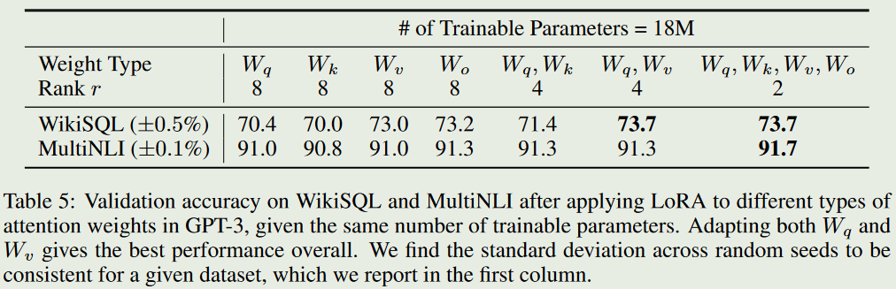
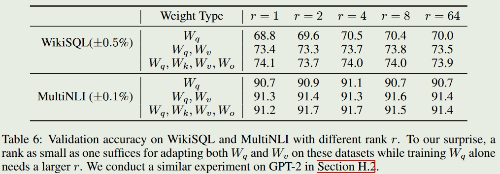

# LoRA:低秩自适应

本章节是对[轻松上手微调大语言模型——QLORA篇](fine_tuningLLM.md)中提到的LoRA的原理解释。

### 背后动机
现今模型的参数量变得越来越大，对预训练模型进行全微调变得越来越不可行。为了解决这个问题有了LoRA（Low-Rank Adaption）的诞生。将可训练的秩分解矩阵注入到每个模型中架构的层，极大的减少下游任务的训练参数量。以GPT-3 175B微调为例，相较于以Adam微调的GPT-3 175B, LoRA 可以减少10000倍训练参数，并且所需的GPU内存减少3倍。

LORA的优势：

+ LoRA 通过大幅减少可训练参数的数量，使微调更加高效。
+ 原始预训练权重保持冻结状态，这意味着您可以拥有多个轻量级、便携式 LoRA 模 型，用于在其之上构建的各种下游任务。
+ LoRA可以与其他许多方法结合使用，比如Prefix-tuning。
+ **使用 LoRA 微调的模型的性能与完全微调的模型的性能相当**。

### 思想

假设我们有权重位$W_0$密集层,以梯度$\nabla W_0$更新。则新的权重为：
$$
W_1=W_0+\nabla W_0
$$
经过$n$次梯度下降得到：
$$
W_2=W_1+\nabla W_1\\
W_3=W_2+\nabla W_2\\
\vdots\\
W_n=W_{n-1}+\nabla W_{n-1}=W_0+\sum_{i=0}^{n-1}\nabla W_i=W_0+\nabla W
$$
因为现在的大模型一般是过参数化的，所以我们可以使用两个秩（r）比较低的两个矩阵$BA$来拟合。

LoRA 可以应用于神经网络中权重矩阵的任何子集，以减少可训练参数的数量。然而，为了简单性和进一步的参数效率，LoRA 通常仅应用于 Transformer 模型中的注意力块。 LoRA 模型中可训练参数的数量取决于更新矩阵的大小，而更新矩阵的大小主要由秩 r 和原始权重矩阵的形状决定。

**注意**：由于LoRA实质上就是在原权重矩阵的基础上，加上了我们训练得到的新权重，而原始模型参数保持不变。故此，对于不同的任务，可以只保存训练的LoRA权重也就是上文提到的$\nabla W=BA$,而不必多次保存原始模型，当用于不同任务时，只需卸载当前的LoRA权重，加载相应得LoRA权重即可。

### 一些实验性的结果

#### 是否应该对所有参数都微调？

表中的$W_q,W_k,W_v,W_o$分别表示自注意力机制的查询、键、值和输出权重参数。
从表中可看出，将所有参数都放入$\nabla W_q$或$\nabla W_k$会导致性能显著降低，而同时采用$\nabla W_q$和$\nabla W_k$会得到最好的结果。这表明，即使是4的秩也能捕获$\nabla W$中足够多的信息，以至于采用更多的权重矩阵比采用秩更大的单一类型的权重更好。

#### LoRA的秩如何挑选？

原论文作者认为增大r并不能覆盖一个更有意义的子空间，一个低秩的适应矩阵是足够的。