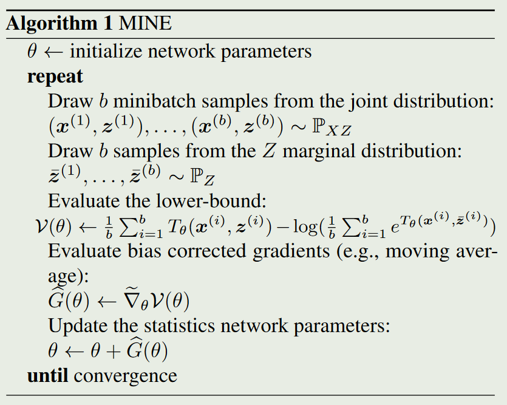

# Mutual Information Neural Estimation

## 摘要
文章认为高维连续随机变量之间的互信息可以通过在神经网络上梯度下降优化得到。
文中提出了互信息估计器(Mutual Information Neural Estimator),它在维度和
样本大小上都是可伸缩的，可以通过反向传播训练的，并且具有很强的**一致性**。
文章提出了一些可以使用MINE来最小化或最大化互信息的
应用。作者应用MINE来改进对抗训练的生成模型。还使用MINE来实现信息瓶颈，将其应用到监督分类中：结果表明，在这些设置中，灵活性和性能有很大的改善。

#### 背景知识补充1
与相关系数相比，**互信息可以捕获非线性关系**。
$$
\begin{align}
H(X) &= -\sum_x p(x)log(p(x))\\
     &= -\mathbb{E}_x[log(p(x))] \notag\\
H(X|Z) &= -\sum_z p(z)\sum_x p(x|z)log(p(x|z))\\
I(X, Z) &= \sum_x\sum_z p(x, z)log\frac{p(x, z)}{p(x)p(z)}\\
        &= D_{KL}(p(x, z)||p(x)p(z)) \\
        &= H(X)-H(X|Z)\\
        &= H(Z)-H(Z|X)
\end{align}
$$
$H$是信息熵，$I$是互信息。

## KL散度的对偶(Dual)表示

### Donsker-Varadhan represention
+ 理论1(Q,P指分布，dQ,dP密度函数)：
  $$
    D_{KL}(P||Q)=\sup\limits_{T:\Omega\rightarrow R}\mathbb{E}_P{[T]}-log(\mathbb{E}_Q[e^T])
$$
  其中$T$表示所有任意函数。
- 证明理论1:令$dG=\frac{1}{Z}e^TdQ$，其中$Z=\mathbb{E}_Q[e^T]$.
$$
\begin{align}
\frac{dG}{dQ}&=\frac{1}{Z}e^T\\
\mathbb{E}_P[\mathbb{E}_Q]&=\mathbb{E}_Q\\
\mathbb{E}_P[log\frac{dG}{dQ}]&=\mathbb{E}_P[T]-log(Z)\\
\Delta :&=D_{KL}(P||Q)-(\mathbb{E}_P[T]-log(Z))\\
 &= \mathbb{E}_P\left[log\frac{dP}{dQ}-log\frac{dG}{dQ}\right]\\
        &= \mathbb{E}_P\left[log \frac{dP}{dG}\right]=D_{KL}(P||G)\ge 0\\
D_{KL}(P||Q)&\ge \mathbb{E}_P{[T]}-log(\mathbb{E}_Q[e^T])
\end{align}
$$
可以看到，当$G==P$时，取等号，即边界是贴近的，$T^*=log\frac{dP}{dQ}+C$。

### $f$-divergence representation

$$
    D_{KL}(P||Q)\ge\sup\limits_{T\in \mathcal{F}}\mathbb{E}_P{[T]}-log(\mathbb{E}_Q[e^{T-1}])
$$

尽管对于足够大的族$\mathcal{F}$,两种表示都可以逼近散度，但是Donsker-Varadhan 界限更强。
$$
    \mathbb{E}_P{[T]}-log(\mathbb{E}_Q[e^{T}])\ge\mathbb{E}_P{[T]}-log(\mathbb{E}_Q[e^{T-1}])
$$

## 方法

使用神经网络参数化函数$T$：
$$
I(X, Z)\ge I_\Theta(X, Z)\\
I_\Theta(X, Z)=\sup\limits_{\theta\in\Theta}\mathbb{E}_{P_{XZ}}{[T_\theta]}-log(\mathbb{E}_{P_{X}P_{Z}}[e^{T_\theta}])
$$
训练神经网络尽量增大$I_\Theta$以逼近$I(X, Z)$。

### 定义MINE：  
$$
\widehat{I(X,Z)}_n=\sup\limits_{\theta\in\Theta}\mathbb{E}_{P^n_{XZ}}{[T_\theta]}-log(\mathbb{E}_{P^n_{X}P^n_{Z}}[e^{T_\theta}])
$$
其中$P^n$表示独立同分布的n个样本的经验分布。  

算法中提供了 MINE 实现的详细信息。类似的定义和算法也适用于$f-divergence$散度公式,称为$MINE-f$。它通常会导致互信息的估计量更宽松。然而，在小批量设置中，MINE的SGD梯度是有偏差的,不过可以调小学习率来调节偏差。

### 定义强一致性
> 如果对任意$\epsilon\ge 0$,都存在一个正整数$N$和一个网络，使得：
$$
\forall n\ge N,\quad |I(X,Z)-\widehat{I(X,Z)}|\le \epsilon
$$
