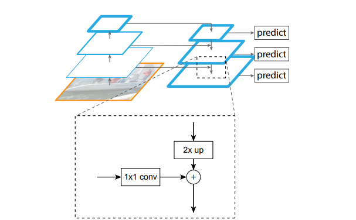

# SMA2:代码实现详解——Image Encoder篇（FpnNeck）

## 总配置YAML文件、OmegaConf和hydra

SAM2的官方实现是使用yaml文件来配置整体的模型结构与参数的。关键代码如下：

```python {.line-numbers}
def build_sam2(
    config_file,
    ckpt_path=None,
    device="cuda",
    mode="eval",
    hydra_overrides_extra=[],
    apply_postprocessing=True,
):

    if apply_postprocessing:
        hydra_overrides_extra = hydra_overrides_extra.copy()
        hydra_overrides_extra += [
            # dynamically fall back to multi-mask if the single mask is not stable
            "++model.sam_mask_decoder_extra_args.dynamic_multimask_via_stability=true",
            "++model.sam_mask_decoder_extra_args.dynamic_multimask_stability_delta=0.05",
            "++model.sam_mask_decoder_extra_args.dynamic_multimask_stability_thresh=0.98",
        ]
    # Read config and init model
    cfg = compose(config_name=config_file, overrides=hydra_overrides_extra)
    OmegaConf.resolve(cfg)
    model = instantiate(cfg.model, _recursive_=True)
    _load_checkpoint(model, ckpt_path)
    model = model.to(device)
    if mode == "eval":
        model.eval()
    return model

```

从代码的第10行到第20行都是在配置模型参数。第19行的`compose`函数与第21行的`instantiate`函数都是`hydra库`的库函数。Hydra是一个开源Python框架，也是由Meta团队开发的，它可简化研究和其他复杂应用程序的开发。其主要功能是能够通过组合动态创建分层配置，并通过配置文件和命令行覆盖它。Hydra对yaml文件的读写操作是基于`OmegaConf库`的。

回到我们的代码，第19行的`compose`函数用来读取`config_name`参数指定的yaml文件，生成可类似于Dict访问的Python对象，并根据`overrides`参数的内容，覆盖从yaml得到的部分参数内容。

第21行的`instantiate`函数根据yaml文件中的配置信息实际构建网络模型。这个地方只用文字可能不太好理解，我们举个例子：
例子yaml文件:

```yaml {.line-numbers}
optimizer:
  _target_: my_app.Optimizer
  algo: SGD
  lr: 0.01

```

例子class文件:

```python {.line-numbers}
class Optimizer:
    algo: str
    lr: float

    def __init__(self, algo: str, lr: float) -> None:
        self.algo = algo
        self.lr = lr
```

例子实例化函数:

```python {.line-numbers}
opt = instantiate(cfg.optimizer)
print(opt)
# Optimizer(algo=SGD,lr=0.01)

# override parameters on the call-site
opt = instantiate(cfg.optimizer, lr=0.2)
print(opt)
# Optimizer(algo=SGD,lr=0.2)
```

那么我们接下来见一下SMA2的具体构造（以tiny版本为例）:

```yaml {.line-numbers}
model:
  _target_: sam2.modeling.sam2_base.SAM2Base
  image_encoder:
    _target_: sam2.modeling.backbones.image_encoder.ImageEncoder
    scalp: 1
    trunk:
      _target_: sam2.modeling.backbones.hieradet.Hiera
      embed_dim: 96
      num_heads: 1
      stages: [1, 2, 7, 2]
      global_att_blocks: [5, 7, 9]
      window_pos_embed_bkg_spatial_size: [7, 7]
    neck:
      _target_: sam2.modeling.backbones.image_encoder.FpnNeck
      position_encoding:
        _target_: sam2.modeling.position_encoding.PositionEmbeddingSine
        num_pos_feats: 256
        normalize: true
        scale: null
        temperature: 10000
      d_model: 256
      backbone_channel_list: [768, 384, 192, 96]
      fpn_top_down_levels: [2, 3]  # output level 0 and 1 directly use the backbone features
      fpn_interp_model: nearest

  memory_attention:
    _target_: sam2.modeling.memory_attention.MemoryAttention
    d_model: 256
    pos_enc_at_input: true
    layer:
      _target_: sam2.modeling.memory_attention.MemoryAttentionLayer
      activation: relu
      dim_feedforward: 2048
      dropout: 0.1
      pos_enc_at_attn: false
      self_attention:
        _target_: sam2.modeling.sam.transformer.RoPEAttention
        rope_theta: 10000.0
        feat_sizes: [32, 32]
        embedding_dim: 256
        num_heads: 1
        downsample_rate: 1
        dropout: 0.1
      d_model: 256
      pos_enc_at_cross_attn_keys: true
      pos_enc_at_cross_attn_queries: false
      cross_attention:
        _target_: sam2.modeling.sam.transformer.RoPEAttention
        rope_theta: 10000.0
        feat_sizes: [32, 32]
        rope_k_repeat: True
        embedding_dim: 256
        num_heads: 1
        downsample_rate: 1
        dropout: 0.1
        kv_in_dim: 64
    num_layers: 4

  memory_encoder:
      _target_: sam2.modeling.memory_encoder.MemoryEncoder
      out_dim: 64
      position_encoding:
        _target_: sam2.modeling.position_encoding.PositionEmbeddingSine
        num_pos_feats: 64
        normalize: true
        scale: null
        temperature: 10000
      mask_downsampler:
        _target_: sam2.modeling.memory_encoder.MaskDownSampler
        kernel_size: 3
        stride: 2
        padding: 1
      fuser:
        _target_: sam2.modeling.memory_encoder.Fuser
        layer:
          _target_: sam2.modeling.memory_encoder.CXBlock
          dim: 256
          kernel_size: 7
          padding: 3
          layer_scale_init_value: 1e-6
          use_dwconv: True  # depth-wise convs
        num_layers: 2

  num_maskmem: 7
  image_size: 1024
  # apply scaled sigmoid on mask logits for memory encoder, and directly feed input mask as output mask
  # SAM decoder
  sigmoid_scale_for_mem_enc: 20.0
  sigmoid_bias_for_mem_enc: -10.0
  use_mask_input_as_output_without_sam: true
  # Memory
  directly_add_no_mem_embed: true
  # use high-resolution feature map in the SAM mask decoder
  use_high_res_features_in_sam: true
  # output 3 masks on the first click on initial conditioning frames
  multimask_output_in_sam: true
  # SAM heads
  iou_prediction_use_sigmoid: True
  # cross-attend to object pointers from other frames (based on SAM output tokens) in the encoder
  use_obj_ptrs_in_encoder: true
  add_tpos_enc_to_obj_ptrs: false
  only_obj_ptrs_in_the_past_for_eval: true
  # object occlusion prediction
  pred_obj_scores: true
  pred_obj_scores_mlp: true
  fixed_no_obj_ptr: true
  # multimask tracking settings
  multimask_output_for_tracking: true
  use_multimask_token_for_obj_ptr: true
  multimask_min_pt_num: 0
  multimask_max_pt_num: 1
  use_mlp_for_obj_ptr_proj: true
  # Compilation flag
  # HieraT does not currently support compilation, should always be set to False
  compile_image_encoder: False
```

如同我们在[SMA2](#)里面所讲的那样，SMA2模型由`image_encoder`、`memory_attention`、`memory_encoder`所构成（见Yaml的第3，26，59行）。

## Image Encoder

从yaml文件中，我们可以清晰的看到，`Image Encoder`由两部分组成，分别是`Hiera`模型作为**trunk**和`FpnNeck`作为**neck**。
`Hiera`是一个掩码自编码器MAE，是论文"Hiera: A hierarchical vision transformer without the bells-and-whistles. ICML, 2023."中提出的预训练模型。使用`Hiera`的编码器提取特征，并使用特征金字塔
(FPN，`FpnNeck`)来融合提取出的特征。

接下来我们看一下`Image Encoder`的代码：

```python {.line-numbers}
class ImageEncoder(nn.Module):
    def __init__(
        self,
        trunk: nn.Module,
        neck: nn.Module,
        scalp: int = 0,
    ):
        super().__init__()
        self.trunk = trunk
        self.neck = neck
        self.scalp = scalp
        assert (
            self.trunk.channel_list == self.neck.backbone_channel_list
        ), f"Channel dims of trunk and neck do not match. Trunk: {self.trunk.channel_list}, neck: {self.neck.backbone_channel_list}"

    def forward(self, sample: torch.Tensor):
        # Forward through backbone
        features, pos = self.neck(self.trunk(sample))
        if self.scalp > 0:
            # Discard the lowest resolution features
            features, pos = features[: -self.scalp], pos[: -self.scalp]

        src = features[-1]
        output = {
            "vision_features": src,
            "vision_pos_enc": pos,
            "backbone_fpn": features,
        }
        return output
```

关键代码是第18行，样本在ImageEncoder内部先经过**trunk**，然后再经过**neck**。实际上就是先使用`Hiera`处理得到结果，然后使用`FpnNeck`处理。
FPN其实在图像领域是一个比较早的技术了，和他的名称相同，一目了然。这里就大概解释一下，比如**模块中的`position_encoding`并未对x做操作，只是根据x的形状得到了pos**。


### Neck:FpnNeck

```python {.line-numbers}
class FpnNeck(nn.Module):
   
    '''
    根据yaml中的配置:
    d_model=256,
    backbone_channel_list=[768, 384, 192, 96]
    fpn_top_down_levels=[2, 3]
    fpn_interp_model=nearest
    '''

    def __init__(
        self,
        position_encoding: nn.Module,
        d_model: int,  
        backbone_channel_list: List[int],
        kernel_size: int = 1,
        stride: int = 1,
        padding: int = 0,
        fpn_interp_model: str = "bilinear",
        fuse_type: str = "sum",
        fpn_top_down_levels: Optional[List[int]] = None,
    ):
        super().__init__()
        self.position_encoding = position_encoding
        self.convs = nn.ModuleList()
        self.backbone_channel_list = backbone_channel_list
        for dim in backbone_channel_list:
            current = nn.Sequential()
            current.add_module(  ## 跳步连接中的1阶算子
                "conv",
                nn.Conv2d(
                    in_channels=dim,
                    out_channels=d_model,
                    kernel_size=kernel_size,
                    stride=stride,
                    padding=padding,
                ),
            )

            self.convs.append(current)
        self.fpn_interp_model = fpn_interp_model
        assert fuse_type in ["sum", "avg"]
        self.fuse_type = fuse_type

        # levels to have top-down features in its outputs
        # e.g. if fpn_top_down_levels is [2, 3], then only outputs of level 2 and 3
        # have top-down propagation, while outputs of level 0 and level 1 have only
        # lateral features from the same backbone level.
        if fpn_top_down_levels is None:
            # default is to have top-down features on all levels
            fpn_top_down_levels = range(len(self.convs))
        self.fpn_top_down_levels = list(fpn_top_down_levels)

    def forward(self, xs: List[torch.Tensor]):

        out = [None] * len(self.convs)
        pos = [None] * len(self.convs)
        assert len(xs) == len(self.convs)
        # fpn forward pass
        # see https://github.com/facebookresearch/detectron2/blob/main/detectron2/modeling/backbone/fpn.py
        prev_features = None
        # forward in top-down order (from low to high resolution)
        n = len(self.convs) - 1
        for i in range(n, -1, -1):
            x = xs[i]
            lateral_features = self.convs[n - i](x)
            if i in self.fpn_top_down_levels and prev_features is not None:
                top_down_features = F.interpolate(
                    prev_features.to(dtype=torch.float32),
                    scale_factor=2.0,
                    mode=self.fpn_interp_model,
                    align_corners=(
                        None if self.fpn_interp_model == "nearest" else False
                    ),
                    antialias=False,
                )
                prev_features = lateral_features + top_down_features
                if self.fuse_type == "avg":
                    prev_features /= 2
            else:
                prev_features = lateral_features
            x_out = prev_features
            out[i] = x_out
            pos[i] = self.position_encoding(x_out).to(x_out.dtype)

        return out, pos
```

`interpolate`函数做上采样，`conv` $1\times 1$算子将每个特征映射到相同的维度`d_model`。数据流转形式和上面的图片是一致。

我们可以从代码67行的条件语句可以看出，模型只针对`fpn_top_down_levels`中指定的步骤所得出的特征做FPN融合。输出结果是一个元组(out, pos),我们先看out,out是一个元素全为tensor的列表，每个tensor的形状应为(...,d_model, x.shape[1], x.shape[2])。

```python {.line-numbers}
class PositionEmbeddingSine(nn.Module): ## 传入position_encoding实例的类定义
    """
    This is a more standard version of the position embedding, very similar to the one
    used by the Attention is all you need paper, generalized to work on images.
    """

    def __init__(
        self,
        num_pos_feats,
        temperature: int = 10000,
        normalize: bool = True,
        scale: Optional[float] = None,
    ):
      ...
    @torch.no_grad()
    def forward(self, x: torch.Tensor):
        y_embed = (
            torch.arange(1, x.shape[-2] + 1, dtype=torch.float32, device=x.device)
            .view(1, -1, 1)
            .repeat(x.shape[0], 1, x.shape[-1])
        )
        x_embed = (
            torch.arange(1, x.shape[-1] + 1, dtype=torch.float32, device=x.device)
            .view(1, 1, -1)
            .repeat(x.shape[0], x.shape[-2], 1)
        )

        dim_t = torch.arange(self.num_pos_feats, dtype=torch.float32, device=x.device)
        dim_t = self.temperature ** (2 * (dim_t // 2) / self.num_pos_feats)

        pos_x = x_embed[:, :, :, None] / dim_t
        pos_y = y_embed[:, :, :, None] / dim_t
        pos_x = torch.stack(
            (pos_x[:, :, :, 0::2].sin(), pos_x[:, :, :, 1::2].cos()), dim=4
        ).flatten(3)
        pos_y = torch.stack(
            (pos_y[:, :, :, 0::2].sin(), pos_y[:, :, :, 1::2].cos()), dim=4
        ).flatten(3)
        pos = torch.cat((pos_y, pos_x), dim=3).permute(0, 3, 1, 2)
        self.cache[cache_key] = pos[0]
        return pos
```

他的官方注释也注明了，它非常类似于Attention is all you need中的位置编码：
$$
p_{k, 2i}=sin\left(\frac{k}{10000^{2i/d}}\right)\\
p_{k, 2i+1}=cos\left(\frac{k}{10000^{2i/d}}\right)
$$

代码84、85两行就是在计算$10000^{2i/d}$。87、88两行分别计算了pos_x与pos_y的$\frac{k}{10000^{2i/d}}$.
89-94行则分别完成了对pos_x和pos_y的位置编码计算。

**注意**：**类似而非相同**。代码所示的计算方式如下:

+ 对于pos_x:
  $$
  p_{x, y, 2i}=sin\left(\frac{i}{10000^{2i/d}}\right)\\
  p_{x, y, 2i+1}=cos\left(\frac{i}{10000^{2i/d}}\right)
  $$

+ 对于pos_y:
  $$
  p_{x, y, 2i}=sin\left(\frac{y}{10000^{2i/d}}\right)\\
  p_{x, y, 2i+1}=cos\left(\frac{y}{10000^{2i/d}}\right)
  $$

<!-- ### Hirea

```python
class Hiera(nn.Module):
    """
    Reference: https://arxiv.org/abs/2306.00989
    """

    def __init__(
        self,
        embed_dim: int = 96,  # initial embed dim
        num_heads: int = 1,  # initial number of heads
        drop_path_rate: float = 0.0,  # stochastic depth
        q_pool: int = 3,  # number of q_pool stages
        q_stride: Tuple[int, int] = (2, 2),  # downsample stride bet. stages
        stages: Tuple[int, ...] = (2, 3, 16, 3),  # blocks per stage
        dim_mul: float = 2.0,  # dim_mul factor at stage shift
        head_mul: float = 2.0,  # head_mul factor at stage shift
        window_pos_embed_bkg_spatial_size: Tuple[int, int] = (14, 14),
        # window size per stage, when not using global att.
        window_spec: Tuple[int, ...] = (
            8,
            4,
            14,
            7,
        ),
        # global attn in these blocks
        global_att_blocks: Tuple[int, ...] = (
            12,
            16,
            20,
        ),
        return_interm_layers=True,  # return feats from every stage
    ):
        super().__init__()

        assert len(stages) == len(window_spec)
        self.window_spec = window_spec

        depth = sum(stages)
        self.q_stride = q_stride
        self.stage_ends = [sum(stages[:i]) - 1 for i in range(1, len(stages) + 1)]
        assert 0 <= q_pool <= len(self.stage_ends[:-1])
        self.q_pool_blocks = [x + 1 for x in self.stage_ends[:-1]][:q_pool]
        self.return_interm_layers = return_interm_layers

        self.patch_embed = PatchEmbed(
            embed_dim=embed_dim,
        )
        # Which blocks have global att?
        self.global_att_blocks = global_att_blocks

        # Windowed positional embedding (https://arxiv.org/abs/2311.05613)
        self.window_pos_embed_bkg_spatial_size = window_pos_embed_bkg_spatial_size
        self.pos_embed = nn.Parameter(
            torch.zeros(1, embed_dim, *self.window_pos_embed_bkg_spatial_size)
        )
        self.pos_embed_window = nn.Parameter(
            torch.zeros(1, embed_dim, self.window_spec[0], self.window_spec[0])
        )

        dpr = [
            x.item() for x in torch.linspace(0, drop_path_rate, depth)
        ]  # stochastic depth decay rule

        cur_stage = 1
        self.blocks = nn.ModuleList()

        for i in range(depth):
            dim_out = embed_dim
            # lags by a block, so first block of
            # next stage uses an initial window size
            # of previous stage and final window size of current stage
            window_size = self.window_spec[cur_stage - 1]

            if self.global_att_blocks is not None:
                window_size = 0 if i in self.global_att_blocks else window_size

            if i - 1 in self.stage_ends:
                dim_out = int(embed_dim * dim_mul)
                num_heads = int(num_heads * head_mul)
                cur_stage += 1

            block = MultiScaleBlock(
                dim=embed_dim,
                dim_out=dim_out,
                num_heads=num_heads,
                drop_path=dpr[i],
                q_stride=self.q_stride if i in self.q_pool_blocks else None,
                window_size=window_size,
            )

            embed_dim = dim_out
            self.blocks.append(block)

        self.channel_list = (
            [self.blocks[i].dim_out for i in self.stage_ends[::-1]]
            if return_interm_layers
            else [self.blocks[-1].dim_out]
        )

    def _get_pos_embed(self, hw: Tuple[int, int]) -> torch.Tensor:
        h, w = hw
        window_embed = self.pos_embed_window
        pos_embed = F.interpolate(self.pos_embed, size=(h, w), mode="bicubic")
        pos_embed = pos_embed + window_embed.tile(
            [x // y for x, y in zip(pos_embed.shape, window_embed.shape)]
        )
        pos_embed = pos_embed.permute(0, 2, 3, 1)
        return pos_embed

    def forward(self, x: torch.Tensor) -> List[torch.Tensor]:
        x = self.patch_embed(x)
        # x: (B, H, W, C)

        # Add pos embed
        x = x + self._get_pos_embed(x.shape[1:3])

        outputs = []
        for i, blk in enumerate(self.blocks):
            x = blk(x)
            if (i == self.stage_ends[-1]) or (
                i in self.stage_ends and self.return_interm_layers
            ):
                feats = x.permute(0, 3, 1, 2)
                outputs.append(feats)

        return outputs
``` -->
