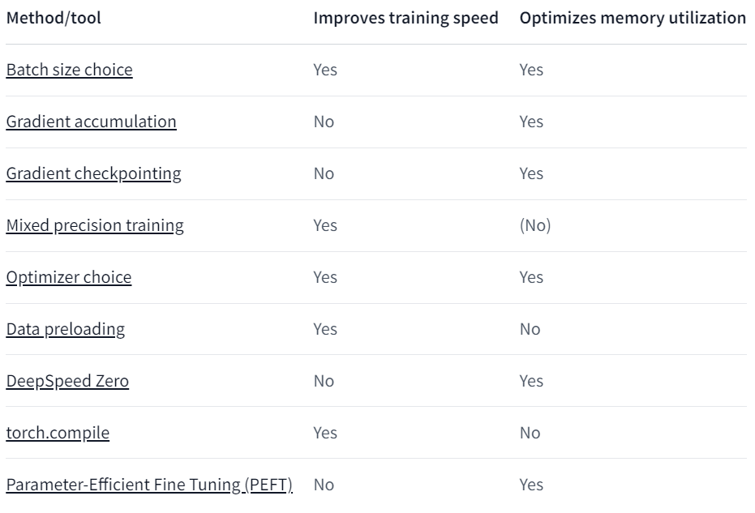

# 轻松上手微调大语言模型——QLORA篇

## 前言
本篇Blog是代码实战篇，着重于新手如何在**消费级GPU**上快速跑通代码，打造属于自己的AI大语言模型。涉及到相关技术的具体原理我会在以后的更新中一一讲解。  
#### 在本篇中我对llama-2进行微调作为示例。

## 先决条件
安装必要的库文件：
```
pip install transformers trl bitsandbytes peft datasets
```

+ **transformers**:已经成为人工智能社区最流行的库之一，它对pytorch、tensorflow及Jax等等流行深度学习框架进行封装，包括数据预处理、模型加载保存和报告、训练流程等等；它使我们可以更好的关注开发算法或应用，而不必重复造轮子。
+ **TRL**：是一个全栈库，提供了一组工具来训练具有强化学习的transformer语言模型，从监督微调步骤(SFT)，奖励建模步骤(RM)到近端策略优化(PPO)步骤。该库集成了🤗transformers。最佳比较火的RLHF训练方式可以轻松使用这个库来实现。
+ **bitsandbytes**:一个量化库，可以兼容QLora。量化模型权重，在尽量不损失模型性能情况下，减小模型大小以及对GPU内存的需求。
+ **peft（Parameter-Efficient Fine-Tuning，参数高效微调）**:用于有效地将大型预训练模型适应各种下游应用程序，而无需微调模型的所有参数，因为它的成本过高。 PEFT 方法仅微调少量（额外）模型参数 - 显着降低计算和存储成本 - 同时产生与完全微调模型相当的性能。这使得在消费类硬件上训练和存储大型语言模型 (LLM) 变得更加容易。像LORA、P-Tuning、Prefix tuning等都已被实现，开发者可以轻松使用。
+ **Datasets**:用于轻松访问和共享音频、计算机视觉和自然语言处理 (NLP) 任务的数据集。只需一行代码即可加载数据集，并使用强大的数据处理方法快速获取本地数据集，准备好进行深度学习模型的训练。在 Apache Arrow 格式的支持下，通过零拷贝读取处理大型数据集，没有任何内存限制，以获得最佳速度和效率。并与 Hugging Face Hub 进行深度集成，可以轻松加载数据集并与更广泛的机器学习社区共享数据集。

## 代码实战
1. 导入对应模块
    ```python
    import transformers
    import datasets
    from transformers import (
        AutoModelForCausalLM,
        AutoTokenizer,
        BitsAndBytesConfig,
        HfArgumentParser,
        TrainingArguments,
        pipeline,
        logging,
    )
    from peft import LoraConfig, PeftModel
    from trl import SFTTrainer
    ```
2. 加载数据集  
    使用datasets库可以方便高效的加载本地或者云端的数据集。加载的方式有很多种，我这里介绍一种比较常用的方法，对于没有任何编程基础的同学可以直接选择此方法。datasets详细用法我会在[transformers常用库详解（待更新）](#)中详细介绍。
    + 使用load_datasets()方法。  
        ```python
        dataset = datasets.load_dataset(
            "mlabonne/guanaco-llama2-1k", #如果要加载本地数据则换为本地路径
            split="train", #如果没有这个参数将返回DatasetDict对象，可以使用类似字典的方式操作。
            )
        ```
3. 配置量化参数  
    量化模型，大幅减少模型GPU内存占用量。
    ```
    quantization_config = BitsAndBytesConfig(
                load_in_4bit=True,
                bnb_4bit_compute_dtype='float16',
                bnb_4bit_quant_type="nf4",
                bnb_4bit_use_double_quant=True,
                )
    ```
    bnb_4bit_quant_type='nf4':NF4是QLoRA论文中的4位数据类型，适用于从正态分布初始化的权重bnb_4bit_quant_type对性能不会产生巨大影响。
    bnb_4bit_use_double_quant:二次量化也称嵌套量化。可以节省额外内存而无需额外性能成本。此功能对已量化的权重执行第二次量化，以额外节省0.4位/参数。
    bnb_4bit_compute_dtype:如果CUDA版本较新可以设置为'bf16'加速计算。

4. 加载模型
    ```python
    model = AutoModelForCausalLM.from_pretrained(
        'meta-llama/Llama-2-7b-hf', ##如果没有访问权限可在huggingface申请并添加token=access_token参数
        quantization_config=quantization_config
    )
    model.config.use_cache = False
    model.config.pretraining_tp = 1

    # 加载llama tokenizer
    tokenizer = AutoTokenizer.from_pretrained(
        'meta-llama/Llama-2-7b-hf',
        trust_remote_code=True)
    tokenizer.pad_token = tokenizer.eos_token
    tokenizer.padding_side = "right"
    ```

5. 配置LoRA
    ```python
    peft_config = LoraConfig(
        lora_alpha=16,
        lora_dropout=0.1,
        r=16,
        bias="none",
        task_type="CAUSAL_LM",
    )
    ```

6. 配置训练参数
    为了加速训练，高效利用GPU，我们可以采用一些方法。
    

    ```python
    training_args = TrainingArguments(
         output_dir='dirname',
         per_device_train_batch_size=1,
         gradient_accumulation_steps=4,
         gradient_checkpointing=True,
         #fp16=True,
         bf16=True,
         optim="adamw_bnb_8bit",
         logging_steps=25,
         learning_rate=2e-4,
         max_grad_norm = 0.3,
         warmup_ratio = 0.03,
         num_train_epochs=2,
         report_to="none", #默认wandb，可以换为tensorboard，或者不需要报告
        # push_to_hub=True,#是否将模型同步到huggingface hub
        )
    ```
    **gradient accumulation**:梯度累积方法旨在以较小的增量计算梯度，而不是一次计算整个批次的梯度。这种方法涉及通过向前和向后遍历模型并在此过程中累积梯度来迭代计算较小批次的梯度。一旦积累了足够数量的梯度，就会执行模型的优化步骤。通过采用梯度累积，可以将有效批量大小增加到超出 GPU 内存容量的限制。但是，需要注意的是，梯度累积引入的额外前向和后向传递可能会减慢训练过程。虽然建议尽可能最大化 GPU 使用率，但大量梯度累积步骤可能会导致更明显的训练速度减慢。考虑以下示例。假设没有梯度累积的 per_device_train_batch_size=4 就达到了 GPU 的极限。如果您想使用大小为64的批次进行训练，请勿将per_device_train_batch_size设置为 1，并将gradient_accumulation_steps设置为64。相反，保留 per_device_train_batch_size=4并设置gradient_accumulation_steps=16。

    **Gradient Checkpointing**:梯度检查点提供了“保存前向传递中的所有激活以便在后向传递期间计算梯度”与“在向后传递过程中丢弃激活并在需要时重新计算它们”这两种方法之间的折衷方案，并在整个计算图中保存了战略选择的激活，因此只需为梯度重新计算一小部分激活。

    **Mixed precision training(bf16, fp16)**:通过对某些变量使用较低精度的数值格式来优化训练模型的计算效率,如果可以使用Ampere或更新的硬件，则可以使用bf16进行混合精度训练和评估。

7. 配置Trainer  
    此处使用SFTTrainer，它继承自Trainer类，但是优化了CAUSAL_LM任务训练流程，无需我们提供Label标签。
    ```python
    trainer = SFTTrainer(
        model=model,
        train_dataset=dataset,
        peft_config=peft_config,
        dataset_text_field="text",
        max_seq_length=None,
        tokenizer=tokenizer,
        args=training_args,
    )
    ```

8. 训练与保存模型
    ```python
    trainer.train()

    trainer.model.save_pretrained('new_model_name')
    ```