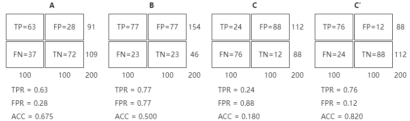
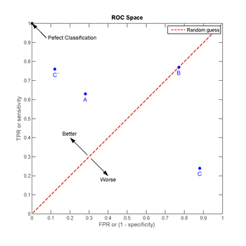
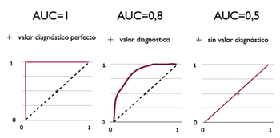

# 轻松上手Scikit-learn——评估模型性能（准确率、精确率、召回率、ROC和AUC）

### 安装scikit——learn
```bash
pip install -U scikit-learn
```

## 常用模型性能评估指标

在开始介绍之前先规定几个表示：
+ 模型预测正确的正样本，称为真正样本（True Positive），简写**TP**。
+ 模型预测正确的负样本，称为真负样本（True Negative），简写**TN**。
+ 模型预测错误的正样本，称为假正样本（False Positive），简写**FP**。
+ 模型预测错误的负样本，称为假负样本（False Negative），简写**FN**。
+ y表示样本的Ground Truth
+ $\hat{y}$表示模型对于样本的预测从属。
+ 真正率：$TPR=TP/(TP+FN)$
+ 假正率：$FPR=FP/(FP+TN)$
+ 真负率：$TNR=TN/(TN+FP)=1-FPR$

### 准确率
1. 常用准确率
    $$
    accuracy(y,\hat{y})=\frac{1}{n_{samples}}\sum_{i=0}^{n_{samples}-1}1(\hat{y_i}==y_i)
    $$
    其中：
    $$
    1(\hat{y_i}==y_i)=
    \begin{cases}
    1 & \text{if } \hat{y_i}==y_i\ ,\\
    0 & \text{others}\ .
    \end{cases}
    $$

    使用sklearn快速计算准确率:
    ```python
    from sklearn.metrics import accuracy_score
    y_pred = [0, 2, 1, 3]
    y_true = [0, 1, 2, 3]
    accuracy_score(y_true, y_pred, normalize=True, sample_weight=None)
    ```
    accuracy_score函数共有4个参数。  
    + `y_true, y_pred`是必须参数，分别表示Ground truth标签和预测标签（一般是模型返回的结果）。
    + `normalize=True`是默认参数,默认为`True`。如果`normalize=False`返回正确分类的样本数,否则返回正确分类的样本的占比分数。
    + `sample_weight=None`是默认参数,默认为`None`。表示样本的权重。

2. top-k准确率
    常用accuracy实际上是top-k accurary的特例，当$k=1$时，$top-1\ accurary=accuracy$
    
    在分类时，模型的结果往往是一系列概率。例如：$[0.2, 0.15, 0.1, 0.25, 0.3]$表示模型认为当前样本属于标签0的概率为0.2；属于标签1的概率为0.15属于标签2的概率为0.1；属于标签3的概率为0.25；属于标签4的概率为0.3。

    使用top-k时，按照预测概率从大到小排序，只要从属于真标签的预测概率在前k个之内，便算做正确。比如top-1就是前1个，即必须真标签对应最大预测概率。

    $$
    top-k accurary(y, \hat{f})=\frac{1}{n_{samples}}\sum_{i=0}^{n_{samples}-1}\sum_{j=1}^{k}1(y_i=\hat{f}_{i,j})
    $$

    其中$\hat{f}$表示模型的预测的概率结果，$f_{i,j}$表示模型推断第$i$个样本属于第$j$类的概率。

    使用sklearn快速计算top-k准确率:
    ```python
    from sklearn.metrics import top_k_accuracy_score
    y_true = np.array([0, 1, 2, 2])
    y_score = np.array([[0.5, 0.2, 0.2],
                        [0.3, 0.4, 0.2],
                        [0.2, 0.4, 0.3],
                        [0.7, 0.2, 0.1]])
    top_k_accuracy_score(y_true, y_score, k=2)
    # Not normalizing gives the number of "correctly" classified samples
    top_k_accuracy_score(y_true, y_score, k=2, normalize=False)
    ```

### 精确率Precision

精确率有时也叫查准率，是指模型的预测结果有多少是准确的。计算如下：
$$
precision=\frac{TP}{TP+FP}
$$
**注意**：不要和$TPR$搞混。
使用sklearn快速计算精确率Precision:
```python
from sklearn.metrics import precision_score
y_true = [0, 1, 2, 0, 1, 2]
y_pred = [0, 2, 1, 0, 0, 1]
precision_score(y_true, y_pred, average='macro')
precision_score(y_true, y_pred, average='micro')
precision_score(y_true, y_pred, average='weighted')
precision_score(y_true, y_pred, average=None)
y_pred = [0, 0, 0, 0, 0, 0]
precision_score(y_true, y_pred, average=None)
precision_score(y_true, y_pred, average=None, zero_division=1)
precision_score(y_true, y_pred, average=None, zero_division=np.nan)
```
当`true positive + false positive == 0`，precision_score返回 0 并引发 `UndefinedMetricWarning`。可以使用`zero_division`修改此行为。

### 召回率
召回率又叫查全率，表示预测出的真正样本占比。
$$
recall = \frac{TP}{TP+FN}=TPR
$$
使用sklearn快速计算召回率:
```python
from sklearn.metrics import recall_score
y_true = [0, 1, 2, 0, 1, 2]
y_pred = [0, 2, 1, 0, 0, 1]
recall_score(y_true, y_pred, average='macro')
recall_score(y_true, y_pred, average='micro')
recall_score(y_true, y_pred, average='weighted')
recall_score(y_true, y_pred, average=None)
y_true = [0, 0, 0, 0, 0, 0]
recall_score(y_true, y_pred, average=None)
recall_score(y_true, y_pred, average=None, zero_division=1)
recall_score(y_true, y_pred, average=None, zero_division=np.nan)
```

### F分数
F值是综合了召回率和精确率的指标。摘自维基百科的样例：
以警察抓犯人的故事为例：

1. 一位警察很厉害，抓了很多犯人，但是这些犯人当中，只有少部分真正有罪，其他都是被冤枉的。
    + recall 高，因为该抓与不该抓的犯人都被抓到了。
    + precision 低，因为很多都是没犯罪的人。
    + “宁可错抓一百，也不可放过一个”，recall 高，但 precision 低。

2. 一个警察非常严谨，只逮捕真正有犯罪的人，不抓实在是没办法肯定的犯人。
    + precision 高，因为通常被抓到人的都是有罪的。
    + recall 低，因为不小心放掉一大群犯人。
    + “宁可错放一百，也不可冤枉一个”，precision 高，但 recall 低。

$$
F_\beta=(1+\beta^2)\frac{precision*recall}{(\beta^2*precision)+recall}=\frac{(1+\beta^2)TP}{(1+\beta^2)TP+FP+\beta^2FN}
$$
常用$F_1$值，即$\beta=1$.
$$
F_1=\frac{2*precision*recall}{precision+recall}=\frac{2}{precision^{-1}+recall^{-1}}=\frac{2*TP}{2*TP+FP+FN}
$$

使用sklearn快速计算F分数:

F1值：
```python
from sklearn.metrics import f1_score
y_true = [0, 1, 2, 0, 1, 2]
y_pred = [0, 2, 1, 0, 0, 1]
f1_score(y_true, y_pred, average='macro')
f1_score(y_true, y_pred, average='micro')
f1_score(y_true, y_pred, average='weighted')
f1_score(y_true, y_pred, average=None)
```
$F_\beta$值：
```python
from sklearn.metrics import fbeta_score
y_true = [0, 1, 2, 0, 1, 2]
y_pred = [0, 2, 1, 0, 0, 1]
fbeta_score(y_true, y_pred, average='macro', beta=0.5)
fbeta_score(y_true, y_pred, average='micro', beta=0.5)
fbeta_score(y_true, y_pred, average='weighted', beta=0.5)
fbeta_score(y_true, y_pred, average=None, beta=0.5)
y_pred_empty = [0, 0, 0, 0, 0, 0]
fbeta_score(y_true, y_pred_empty,
            average="macro", zero_division=np.nan, beta=0.5)
```

### ROC和AUC
ROC曲线(接收者操作特征曲线),是一种坐标图式的分析工具，用于选择最佳模型、舍弃次佳的模型或者在同一模型中设置最佳阈值。在做决策时，ROC分析能不受成本／效益的影响，给出客观中立的建议。

ROC将FPR定义为X轴，TPR定义为Y轴。将同一模型**每个阈值**的 (FPR, TPR) 座标都画在ROC空间里，就成为特定模型的ROC曲线。

依旧是来自维基百科的例子：

将这4种结果画在ROC空间里：  

+ 点与随机猜测线的距离，是预测能力的指针：离左上角越近的点,预测准确率越高。离右下角越近的点，预测越不准。
+ 在A、B、C三者当中，最好的结果是A方法。
+ B方法的结果位于随机猜测线（对角线）上，在例子中我们可以看到B的准确度（ACC，定义见前面表格）是50%。
+ C虽然预测准确度最差，甚至劣于随机分类，也就是低于0.5（低于对角线）。然而，当将C以 (0.5, 0.5) 为中点作一个镜像后，C'的结果甚至要比A还要好。这个作镜像的方法，简单说，不管C（或任何ROC点低于对角线的情况）预测了什么，就做相反的结论

使用sklearn快速计算roc曲线:

```python
import numpy as np
from sklearn import metrics
y = np.array([1, 1, 2, 2])
scores = np.array([0.1, 0.4, 0.35, 0.8])
fpr, tpr, thresholds = metrics.roc_curve(y, scores, pos_label=2)
```

### AUC(ROC曲线下面积)



ROC曲线下方的面积AUC（Area under the Curve of ROC），其意义是：
1. 因为是在1x1的方格里求面积，AUC必在0~1之间。
2. 假设阈值以上是阳性，以下是阴性；
3. 若随机抽取一个阳性样本和一个阴性样本，分类器正确判断阳性样本的值高于阴性样本之$概率=AUC$。
4. 简单说：AUC值越大的分类器，正确率越高。

**从AUC判断分类器（预测模型）优劣的标准**：

1. AUC = 1，是完美分类器，采用这个预测模型时，存在至少一个阈值能得出完美预测。绝大多数预测的场合，不存在完美分类器。
2. 0.5 < AUC < 1，优于随机猜测。这个分类器（模型）妥善设置阈值的话，能有预测价值。
3. AUC = 0.5，跟随机猜测一样（例：丢铜板），模型没有预测价值。
4. AUC < 0.5，比随机猜测还差；但只要总是反预测而行，就优于随机猜测。

使用sklearn快速计算AUC:

二分类
```python
from sklearn.datasets import load_breast_cancer
from sklearn.linear_model import LogisticRegression
from sklearn.metrics import roc_auc_score
X, y = load_breast_cancer(return_X_y=True)
clf = LogisticRegression(solver="liblinear", random_state=0).fit(X, y)
roc_auc_score(y, clf.predict_proba(X)[:, 1])
roc_auc_score(y, clf.decision_function(X))
```
多分类
```python
from sklearn.datasets import load_iris
X, y = load_iris(return_X_y=True)
clf = LogisticRegression(solver="liblinear").fit(X, y)
roc_auc_score(y, clf.predict_proba(X), multi_class='ovr')
```
多标签

```python
import numpy as np
from sklearn.datasets import make_multilabel_classification
from sklearn.multioutput import MultiOutputClassifier
X, y = make_multilabel_classification(random_state=0)
clf = MultiOutputClassifier(clf).fit(X, y)
# get a list of n_output containing probability arrays of shape
# (n_samples, n_classes)
y_pred = clf.predict_proba(X)
# extract the positive columns for each output
y_pred = np.transpose([pred[:, 1] for pred in y_pred])
roc_auc_score(y, y_pred, average=None)
from sklearn.linear_model import RidgeClassifierCV
clf = RidgeClassifierCV().fit(X, y)
roc_auc_score(y, clf.decision_function(X), average=None)
```